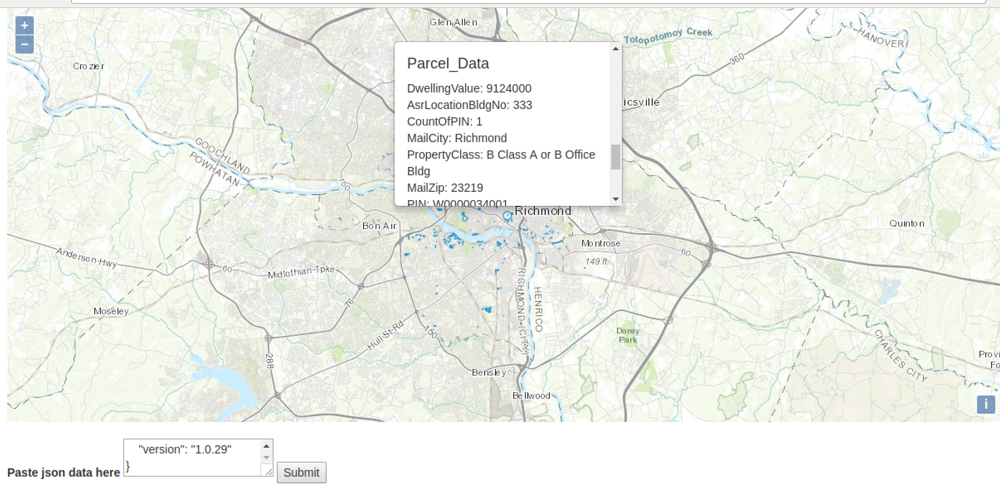
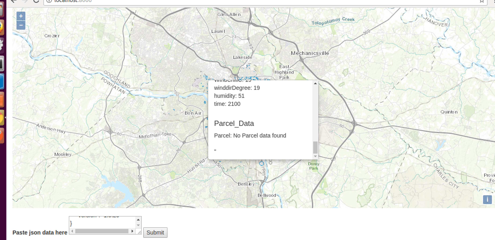
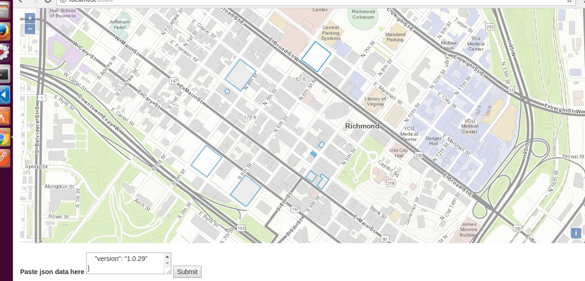

### Install Steps
#### Linux Ubuntu 16

```
cd ~
sudo apt-get install python-pip
pip install virtualenv
mkdir projects
cd projects
virtualenv pechallenge
cd pechallenge
source bin/activate
git clone https://github.com/jediditty/parcelproject.git
cd parcelproject
pip install -r requirements.txt
python manage.py migrate
python manage.py runserver
```

* Once the django server is running navigate to http://localhost:8000

* Base map should be centered on richmond va

* paste desired json into input to harvest weather and parcel data
    - it seems to me that the parcel service does not have data for every reidence so some tests did not bring back data such as F01705150090.json

* service will return valid geojson

#### screen shots




